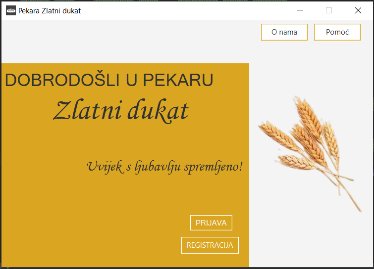
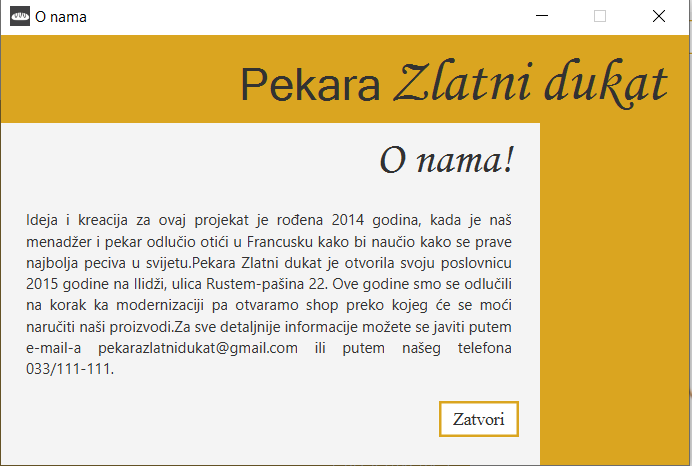
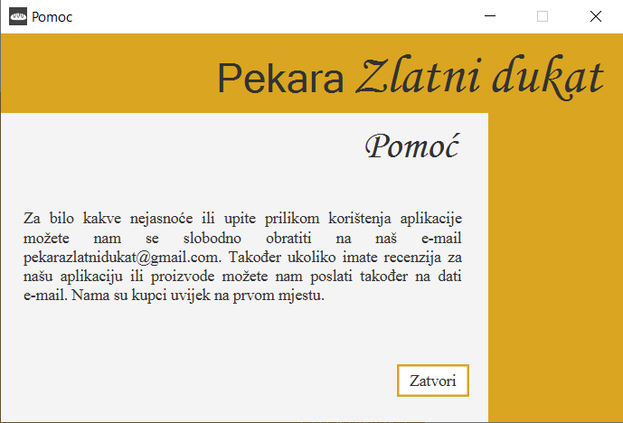
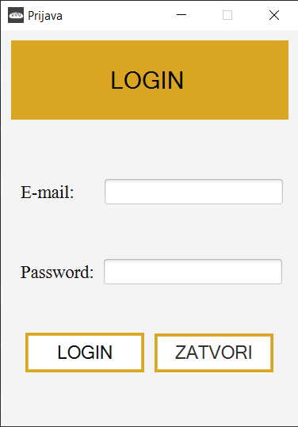
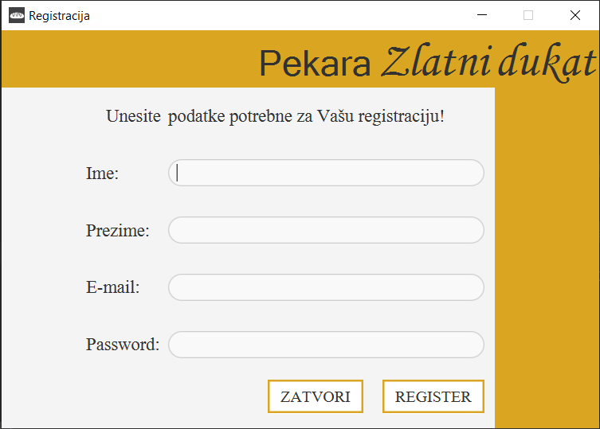
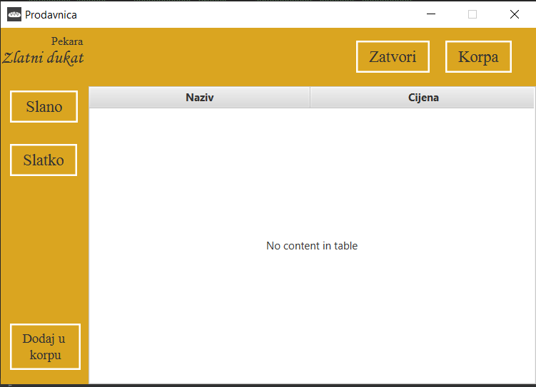
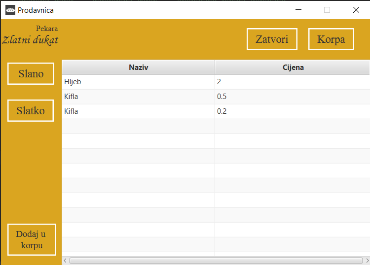

# RPR_projekat
Projekat rađen za predmet Razvoj programskih rješenja, Elektrotehnički fakultet Sarajevo
Tema projekta: Desktop aplikacija za pekaru (naziv pekare Zlatni dukat)

### Početna stranica 

Na početnoj stranici imamo mogućnost da odaberemo login ili registraciju. Također možemo odabrati da saznamo nešto više o projektu ili ukoliko nam je potrebna pomoć možemo kliknuti na dugme pomoć

### Stranica O nama

Ovdje vidimo više informacija o projektu. Dugme zatvori nas vraća na početnu stranicu.

### Stranica Pomoc

Na ovoj stranici možemo saznati na koji način možemo dobiti pomoć pri korištenju stranice.Dugme zatvori nas vraća na početnu stranicu.

### Login stranica

Izgled login stranice.

### Stranica za registraciju

Izgled stranice za registraciju.

### Prodavnica

Izgled prodavnice. Dugmad slatko i slano nam omogućavaju prikaz proizvoda za ove dvije kategorije. Dugme dodaj u korpu selektovani proizvod dodaje u korpi.
Korpa nam omogućava prikaz prozora za korpu.

### Prikaz proizvoda

Ukoliko kliknemo na Slano dobijamo sljedeči prikaz proizvoda.